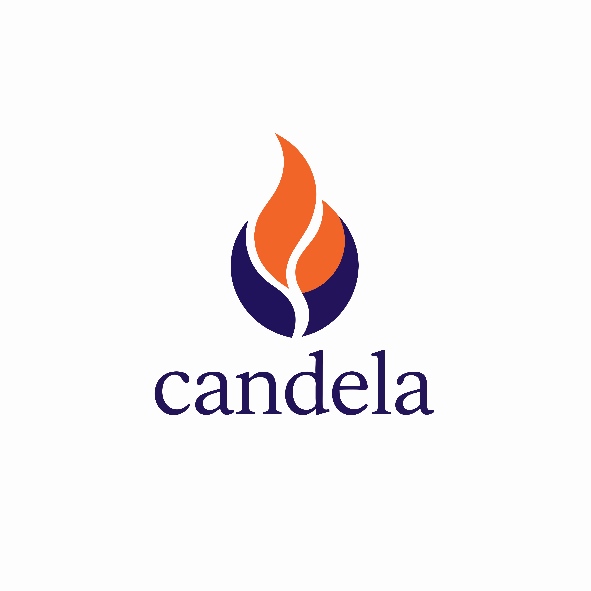

<p align="center">
  
</p>

# Candela

> [!WARNING]
> Candela is under active development and the API is unstable.

**Candela** is a fast, statically-typed interpreted language that combines Rust-like syntax with Python's ease of use. It aims to be a faster alternative to Python that sits closer to low-level languages while staying approachable.

Candela is the embedded scripting language for the Lumen UI framework. A Rust host drives it through the `Engine`/`Program` API (see `src/engine.rs`): register typed host functions, compile a script once, and call script functions by name.

## Origin and attribution

Candela is a fork of [keel](https://github.com/horacehoff/keel) by Horace Hoff.
The original work is licensed under the Apache License, Version 2.0; that license
and Horace Hoff's authorship are retained in full (see `LICENSE` and `NOTICE`).
Candela renames the language and crate and extends it with a host embedding API
(variadic host functions, array/map marshalling, structured diagnostics) for use
inside Lumen. All credit for the original language design and implementation goes
to Horace Hoff.

Upstream project: https://github.com/horacehoff/keel

## Why Candela?

- **Fast**: aggressive compile-time optimizations ([benchmarks](BENCHMARKS.md))
- **Familiar syntax**: Rust-like, with Python's ease of use
- **Statically typed, zero annotations**: full type inference, static type checking, polymorphism
- **FFI support**: call C and dynamic libraries directly from Candela
- **Embeddable**: register typed host functions and drive scripts from a Rust host
- **Built-in REPL**

[Browse examples](examples/)

## Quick showcase

```rust
struct Point { x: int, y: int }

fn add(a, b) {
    return a + b;
}

fn main() {
    let p = Point { x: 3, y: 4 };
    print(add(p.x, p.y)); // 7
    print(add("Hello, ", "world!")); // Hello, world!

    let nums = [4, 2, 6, 1, 7];
    if nums[0] == 4 {
        nums.sort();
        print(if nums[0] == 1 { nums[0..3] } else { -1 }); // [1,2,4]
    } else {
        throw("Error!");
    }
}
```

## Build from source

Make sure [Rust](https://rustup.rs/) is installed.

```sh
cargo build --release
./target/release/candela myfile.cdl
```

## Usage

```sh
candela program.cdl               # Run a file
candela build program.cdl         # Compile to program.cdlb bytecode
candela build program.cdl -o a.cdlb   # ... to a chosen path
candela                           # Start the REPL
candela -v/--version              # Print version
candela -h/--help                 # Print help
```

Candela source files use the `.cdl` extension.

## Ahead-of-time bytecode and the lean `candela-vm`

Candela ships as two binaries:

- **`candela`** is the full toolchain: parser, compiler, VM, REPL, and the
  `Engine`/`Program` embedding API.
- **`candela-vm`** is a small standalone runtime that loads and runs
  pre-compiled bytecode. It carries no parser, compiler, or REPL. The goal is to
  keep it under 1 MiB.

Compile a `.cdl` source to a self-contained `.cdlb` bytecode artifact, then run
it:

```sh
candela build program.cdl         # emits program.cdlb
candela-vm program.cdlb           # loads and runs the bytecode
```

A program behaves the same whether you run its source through `candela` or its
`.cdlb` through `candela-vm`; output and error diagnostics match, since the
source is embedded in the artifact.

A `.cdlb` captures the whole program: every imported `.cdl` module is linked
into the single artifact, so `candela-vm app.cdlb` runs with no source tree
present. Dynamic-library imports are captured by reference rather than by value:
the artifact records the logical library name and each symbol's signature, and
`candela-vm` re-opens the library through the OS loader at load time. A library
named by a bare logical name resolves to the right file for the host OS, so the
same source runs across platforms as long as the library is installed. See the
[dynamic libraries guide](docs/docs/language-tour/dynamic-libraries.md) for the
resolution rules.

A `host`-using program needs an embedding runtime to supply its host functions,
so running one through the standalone `candela-vm` fails to load with an error
naming the missing host function. Run those programs through the `Engine`/`Program`
embedding API instead.

## Editor support

The [VS Code extension](editors/vscode/) provides syntax highlighting plus a
language server (live diagnostics, hover, completion, outline,
go-to-definition) via [`candela-lsp`](lsp/), a separate crate in this
workspace built on candela's own lexer, parser, and type checker.
