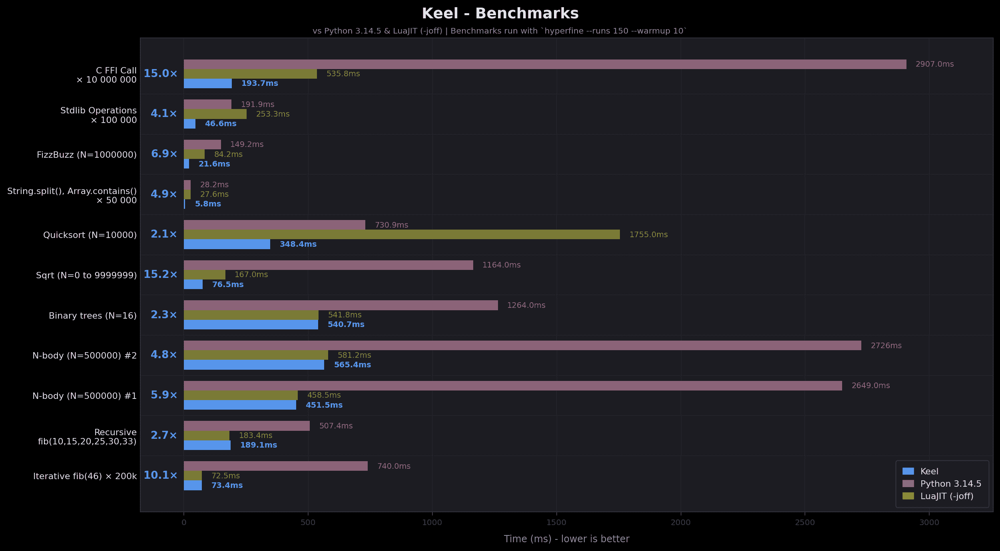

# Get started

## What, and why is Candela ?

!!! warning

    Candela is experimental and under active development (this documentation too). Little is set in stone.

Candela is a fast, statically-typed interpreted language that aims to combine Rust-like syntax with Python's ease-of-use.

Its goal is to provide a (much) faster alternative to Python that sits closer to low-level languages while remaining accessible to a wide audience. In other words, you should like Candela whether you're a seasoned Rust developer or you've barely touched Python and are completely new to programming.

Candela's main 'selling points' are:

- ~10x faster than Python, competitive with LuaJIT (-joff)
- Statically typed, with full type inference and zero annotations
- FFI support, and the ability to call C/dynamic libraries directly from Candela with a native/easy syntax.
- Embeddable in other programs through a C ABI.

The goal of this documentation / tutorial is to show Candela's syntax and how it works by example more than by theory.

## Installation

### On macOS / Linux

Candela provides a macOS / Linux installer, which you can use to download and install Candela by running the following command in your terminal: 
`#!bash curl -fsSL https://raw.githubusercontent.com/lumen-fx/candela/main/install.sh | sh`

This will install the latest Candela version in `Library/Candela` on macOS, and in `/usr/local/lib/candela/` on Linux.

### On Windows

Candela doesn't provide a Windows installer yet. You must manually download it from [the latest release on GitHub](https://github.com/lumen-fx/candela/releases/latest).

## Usage

Once installed, you can use the `candela` command like any other:

- To run the REPL, run: `#!bash candela`
- To run a `.cdl` file [^extension], run: `#!bash candela file.cdl`
- To display Candela's current version, run: `#!bash candela -v` or `#!bash candela --version`
- To display the available commands, run: `#!bash candela -h` or `#!bash candela --help`

[^extension]: Candela files have the `.cdl` file extension.
*[REPL]: Read-Eval-Print-Loop

## Benchmarks
{ loading=lazy }
